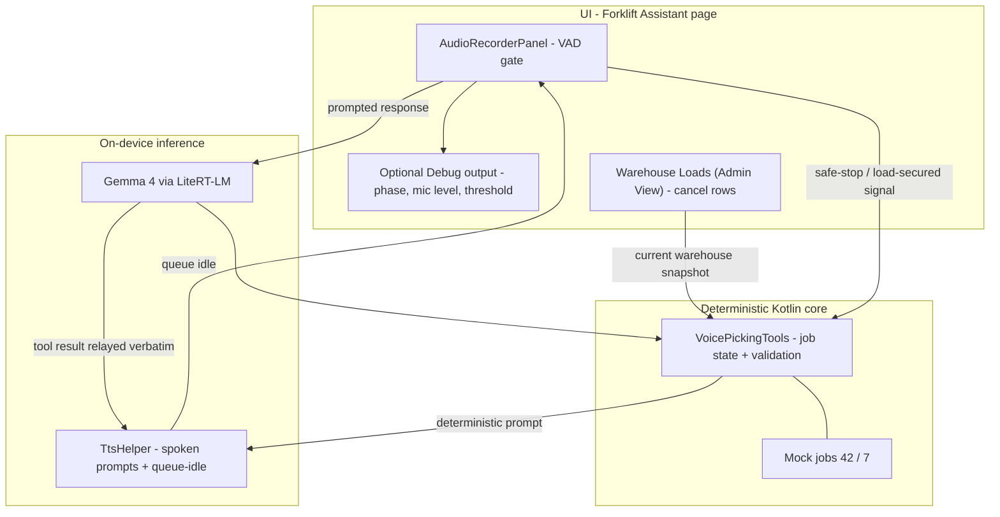

# Forklift Assistant Demo — Architecture

Forklift Assistant is a hands-free, on-device warehouse pickup demo. It has two deliberately
different paths:

- **A prompted operator response** (job number, location check digits, or load-tag digits) is
  recorded and sent to Gemma.
- **A sound in a waiting gate** (safe-stop or load-secured signal) is handled locally. Kotlin moves
  the deterministic forklift state forward and speaks the next prompt without sending that audio to
  Gemma.
- **A spoken load-tag response** is extracted by Gemma and validated by deterministic Kotlin.

This gives the operator clear, context-specific prompts while avoiding needless inference for the
two transition signals.

The page also includes a simple **Warehouse Loads (Admin View)**. Cancelling a future row marks it
`CANCELLED` and causes Kotlin to skip it when choosing the next move. Cancelling the active row
interrupts the current voice turn, announces the change, and immediately replans to the next
available row. This is an in-memory demo snapshot, not a database-backed integration.

## System architecture



## Job 42 walkthrough

```mermaid
sequenceDiagram
  actor W as Operator
  participant V as Forklift Assistant
  participant G as Gemma
  participant K as Kotlin state machine

  W->>V: “start job 42”
  V->>G: Recorded audio
  G->>K: start_order(42)
  K-->>V: Speak navigation instruction

  W->>V: Safe-stop sound / phrase
  V->>K: Local confirm_arrival (no Gemma audio)
  K-->>V: Repeat location; request check digits

  W->>V: “4 7 2”
  V->>G: Recorded audio
  G->>K: verify_check_digits(472)
  K-->>V: Speak equipment-load instruction

  W->>V: Load-secured sound / phrase
  V->>K: Local confirm_item_located (no Gemma audio)
  K-->>V: Request last 3 load-tag digits

  W->>V: “9 5 1”
  V->>G: Recorded audio
  G->>K: confirm_pick(951)
  K-->>V: Mark load PICKED UP
  K-->>V: Speak next location or completion
```

## Pickup state machine

```mermaid
stateDiagram-v2
  [*] --> NOT_STARTED
  NOT_STARTED --> AWAITING_ARRIVAL: start_order valid
  AWAITING_ARRIVAL --> AWAITING_CHECK_DIGITS: local safe-stop signal
  AWAITING_CHECK_DIGITS --> AWAITING_LOAD_SECURED: correct check digits
  AWAITING_CHECK_DIGITS --> AWAITING_CHECK_DIGITS: incorrect check digits
  AWAITING_LOAD_SECURED --> AWAITING_TAG_CONFIRMATION: local load-secured signal
  AWAITING_TAG_CONFIRMATION --> AWAITING_TAG_CONFIRMATION: incorrect load-tag digits
  AWAITING_TAG_CONFIRMATION --> AWAITING_ARRIVAL: correct tag; another move remains
  AWAITING_TAG_CONFIRMATION --> COMPLETE: final correct tag
  AWAITING_ARRIVAL --> AWAITING_ARRIVAL: active load cancelled; replan next move
  AWAITING_CHECK_DIGITS --> AWAITING_ARRIVAL: active load cancelled; replan next move
  AWAITING_LOAD_SECURED --> AWAITING_ARRIVAL: active load cancelled; replan next move
  AWAITING_TAG_CONFIRMATION --> AWAITING_ARRIVAL: active load cancelled; replan next move
  AWAITING_ARRIVAL --> COMPLETE: final remaining load cancelled
  AWAITING_CHECK_DIGITS --> COMPLETE: final remaining load cancelled
  AWAITING_LOAD_SECURED --> COMPLETE: final remaining load cancelled
  AWAITING_TAG_CONFIRMATION --> COMPLETE: final remaining load cancelled
```



| Current state               | System prompt                                                                     | Next event             | Uses Gemma?                                                   |
| --------------------------- | --------------------------------------------------------------------------------- | ---------------------- | ------------------------------------------------------------- |
| `AWAITING_ARRIVAL`          | “Proceed to bay 12, rack position 3, level 2. Speak when safely stopped.”         | Safe-stop sound        | No — local prompt repeats location and asks for check digits. |
| `AWAITING_CHECK_DIGITS`     | “Read the three check digits on the location label.”                              | Spoken digits          | Yes                                                           |
| `AWAITING_LOAD_SECURED`     | “Lift the power generator load, tag ending 9 5 1. Speak when the load is secure.” | Load-secured sound     | No — local prompt requests tag digits.                        |
| `AWAITING_TAG_CONFIRMATION` | “Read the last 3 digits on the load tag to confirm.”                              | Spoken load-tag digits | Yes — Kotlin validates the tag.                               |

## Voice behavior

- After the operator chooses Regular or Fast, the page selects the first downloaded audio-capable
  model and initializes it.
- Capture is 16 kHz mono PCM. Forklift Assistant uses a speech amplitude threshold of **3500**.
- Once speech is detected, **1 second** of silence ends the clip.
- At a waiting gate, the detected clip is discarded after it establishes that the operator is ready.
  The next deterministic prompt is spoken locally.
- In Regular mode, a load-secured signal asks the operator to read the final three digits from the
  load tag. Correct spoken digits advance to the next move.
- After a prompt that needs an answer, the next clip is sent to Gemma as raw audio; there is no
  separate speech-to-text stage.
- TTS completion reopens the microphone. The **Debug output** toggle can hide/show the debug
  panel; it does not affect the flow.
- Cancelling the active load row stops any active TTS/model turn, ignores late callbacks from
  that turn, and speaks a local warehouse-update prompt. The saved Gemma checkpoint remains the
  normal next-move instruction, not the cancellation wording.
- Fast mode removes the separate safe-stop and load-secured gates. Its job-start and next-move
  prompts request location digits directly; after location validation, its equipment prompt asks
  the operator to read the load-tag digits when the load is secure.

## Forklift demo script — job 42

|              |                                                                                                              |
| ------------ | ------------------------------------------------------------------------------------------------------------ |
| **Operator** | “start job 4 2”                                                                                              |
| **System**   | “Job 4 2 started, 3 moves. Proceed to bay 12, rack position 3, level 2. Speak when safely stopped.”          |
| **Operator** | Arrival signal                                                                                               |
| **System**   | “Bay 12, rack position 3, level 2. Read the 3 check digits on the location label.”                           |
| **Operator** | “4 7 2”                                                                                                      |
| **System**   | “Pickup location confirmed. Lift the power generator load, tag ending 9 5 1. Speak when the load is secure.” |
| **Operator** | Load-secured signal                                                                                          |
| **System**   | “Read the last 3 digits on the load tag to confirm.”                                                         |
| **Operator** | “9 5 1”                                                                                                      |
| **System**   | “Pickup confirmed. Next, proceed to bay 7, rack position 1, level 4. Speak when safely stopped.”             |

The second and third moves follow the same pattern:

- **815 → air compressor, load tag 208**
- **339 → water pump, load tag 664**

After the final confirmation: “Pickup confirmed. Job 4 2 complete. Nice work.”

## Optional live warehouse-update beat

Use this after the system has assigned a load, at any point before its pickup confirmation:

|              |                                                                                                                                                  |
| ------------ | ------------------------------------------------------------------------------------------------------------------------------------------------ |
| **Admin**    | Tap **×** on the active load in **Warehouse Loads (Admin View)**.                                                                                |
| **System**   | “Warehouse update. The power generator load is no longer required. Next, proceed to bay 7, rack position 1, level 4. Speak when safely stopped.” |
| **Operator** | Arrival signal                                                                                                                                   |
| **System**   | “Bay 7, rack position 1, level 4. Read the 3 check digits on the location label.”                                                                |

If the admin cancels a later load, the operator is not interrupted; Kotlin skips that row when it
selects the next move. If the cancellation removes the final remaining load, the target system
message is: “Warehouse update. The [load] is no longer required. Job 4 2 is complete. Nice work.”

## File map

| Component     | File                                         | Role                                                                                  |
| ------------- | -------------------------------------------- | ------------------------------------------------------------------------------------- |
| Forklift task | `customtasks/voicepicker/VoicePickerTask.kt` | Initializes the audio model and deterministic tools.                                  |
| Forklift page | `ui/navigation/VoicePickerScreen.kt`         | VAD gates, admin view, local prompts, and audio handoff.                              |
| Pickup tools  | `customtasks/agentchat/VoicePickingTools.kt` | Mock jobs, latest warehouse snapshot, transitions, validation, and warehouse prompts. |
| Voice output  | `common/TtsHelper.kt`                        | Sentence-streamed TTS and queue-idle callback.                                        |
| Voice input   | `ui/common/chat/AudioRecorderPanel.kt`       | PCM capture, amplitude threshold, and silence stop.                                   |
| Inference     | `ui/llmchat/LlmChatModelHelper.kt`           | LiteRT-LM model engine and conversation.                                              |

Everything runs on-device: Gemma via LiteRT-LM and the device’s text-to-speech engine. No network
is used in the forklift pickup loop.
