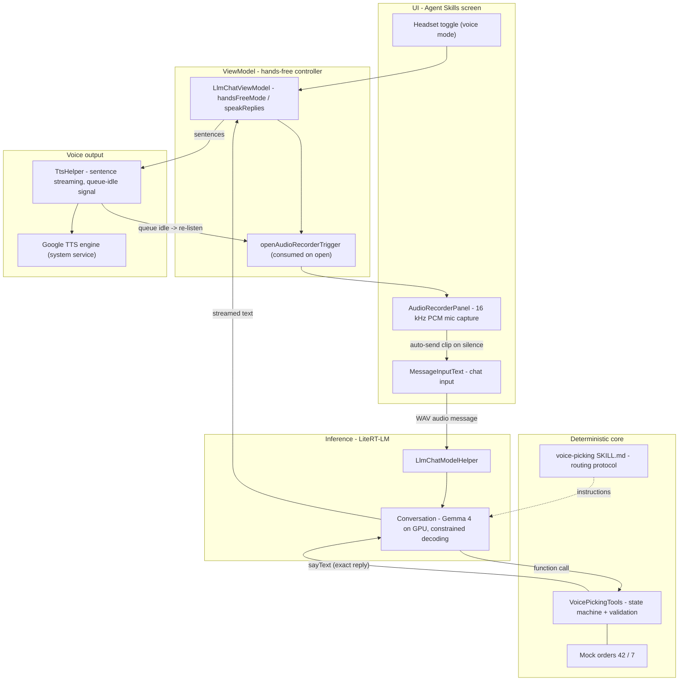
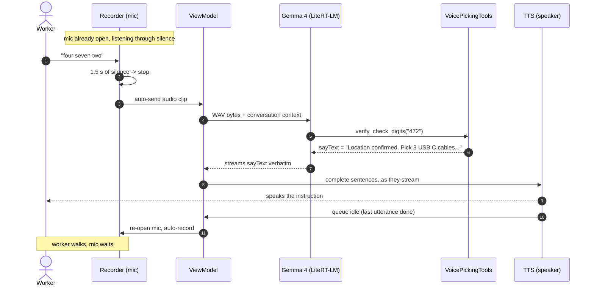
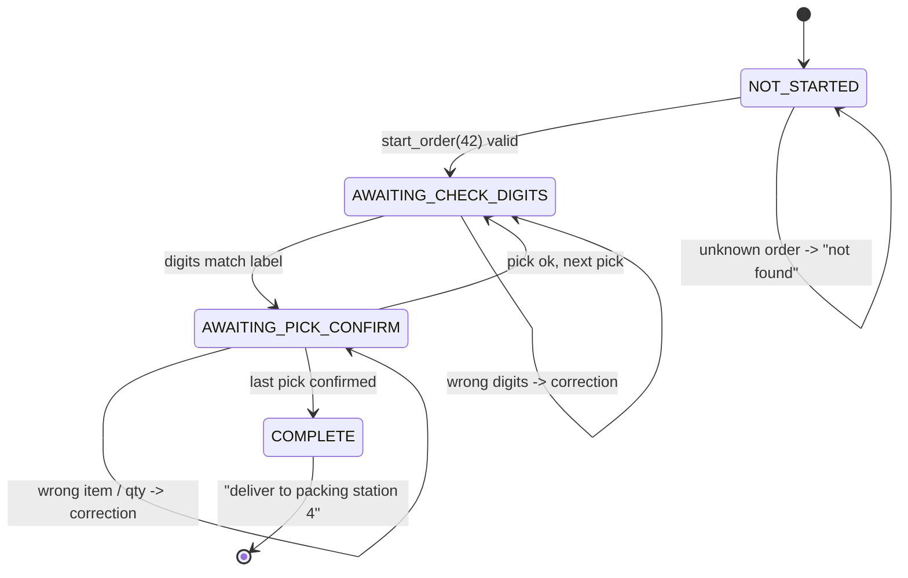
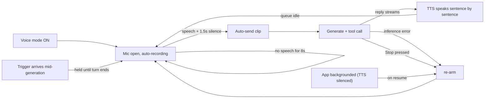

# Voice Picking Demo — Architecture

A hands-free warehouse picking loop running fully on-device, built on the **Agent Skills** task.
**Gemma 4 is the ear and the mouth; Kotlin is the brain**: the model hears the worker and routes
to a tool; every decision, validation, and spoken sentence comes from a deterministic state
machine.

## System architecture

## One hands-free turn

1. The recorder listens continuously; buffered silence is discarded every 8 s so the eventual clip
   stays short while the worker walks.
2. Speech above the amplitude threshold marks the utterance start; 1.5 s of quiet ends it and the
   clip auto-sends.
3. The clip goes to Gemma as raw audio — there is no separate speech-to-text stage.
4. Gemma routes the utterance to exactly one tool call (constrained decoding keeps it well-formed).
5. The tool validates in Kotlin and returns the exact sentence to speak; the model relays it
   verbatim.
6. Text-to-speech starts on the first complete sentence, while the model is still generating.
7. When the last utterance finishes playing, the mic re-opens. Zero taps per turn.

## Picking state machine

| Worker says | Routed to | Validated against |
| --- | --- | --- |
| "start order 4 2" | `start_order` | Known order numbers (42, 7) |
| "4 7 2" (3 digits alone) | `verify_check_digits` | Check digits on the current location label |
| "9 5 1, picked 3" | `confirm_pick` | Item's last-3 digits **and** expected quantity |
| "repeat" / anything else | `repeat_instruction` | — (re-speaks the current instruction) |

## Loop resilience

- **Echo prevention** — opening the mic mutes the speaker; a mute latch stops late model callbacks
  from restarting speech after Stop.
- **Walk-time silence** — no timeout while the worker walks; the mic listens indefinitely.
- **Session hygiene** — resetting the chat, switching models, or changing skills resets the
  picking state machine with the conversation.

## Division of labor (why it's deterministic)

- **The model does**: hear the clip (audio-in, no ASR stage) · map words like "forty two" to
  digits · choose which tool to call · relay `sayText`.
- **Kotlin does**: order data · step ordering · check-digit, item, and quantity validation ·
  every spoken sentence · error corrections · session reset.
- **Belt & braces**: the verbatim-relay rule lives in three places the model always sees — the
  skill, each tool description, and each tool result.

## Demo script — order 42

| | |
| --- | --- |
| **Worker** | "start order 4 2" |
| **System** | "Order 4 2 started, 3 picks. Go to aisle 12, bay 3, shelf 2, and say the 3 check digits on the location label." |
| **Worker** | "4 7 2" |
| **System** | "Location confirmed. Pick 3 USB C cables, item ending 9 5 1. Say the item digits and the quantity you picked." |
| **Worker** | "9 5 1, picked 3" |
| **System** | "Pick confirmed. Next, go to aisle 7, bay 1, shelf 4..." — then 8 1 5 → "2 0 8, picked 1" → aisle 3 → 3 3 9 → "6 6 4, picked 5" |
| **System** | "Pick confirmed. Order 4 2 complete. Deliver to packing station 4. Nice work." |

Check digits: **472 · 815 · 339** — Items: **951×3 · 208×1 · 664×5**. Saying wrong digits once is
worth showing: the spoken correction is a feature.

## File map

| Component | File | Role |
| --- | --- | --- |
| Picking tools | `customtasks/agentchat/VoicePickingTools.kt` | State machine, mock orders, all spoken strings, validation |
| Skill | `assets/skills/voice-picking/SKILL.md` | Utterance → tool routing rules, verbatim-output contract |
| Registration | `agentchat/AgentChatTaskModule.kt`, `AgentChatScreen.kt` | Tools attached to every Agent Skills conversation; session-reset hooks |
| Hands-free controller | `ui/llmchat/LlmChatViewModel.kt` | `handsFreeMode`, mic re-arm paths, TTS feed per streamed chunk |
| Voice out | `common/TtsHelper.kt` | Sentence-streamed TTS, engine fallback, queue-idle signal, mute latch |
| Voice in | `ui/common/chat/AudioRecorderPanel.kt` | Auto-start capture, amplitude-based silence stop, walk-time listening |
| Auto-send | `ui/common/chat/MessageInputText.kt` | Trigger-driven mic open (consumed once), clip → message on silence |
| Inference | `ui/llmchat/LlmChatModelHelper.kt` | LiteRT-LM engine/conversation, tools + constrained decoding, audio bytes in |

Everything runs on-device: Gemma 4 on the GPU via LiteRT-LM, speech synthesis by the phone's
Google TTS engine, capture at 16 kHz mono PCM. No network in the loop.
