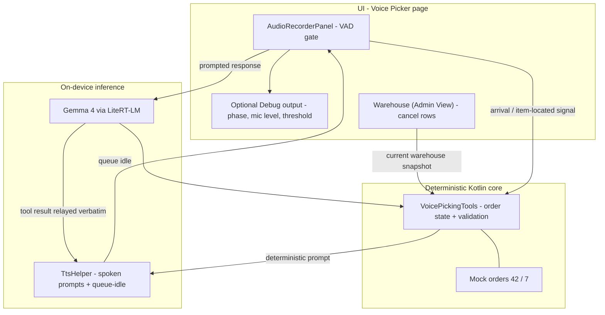

# Voice Picker Demo — Architecture

Voice Picker is a hands-free, on-device warehouse demo. It has two deliberately different paths:

- **A prompted worker response** (order number, check digits, or item/quantity) is recorded and
  sent to Gemma.
- **A sound in a waiting gate** (arrival or item-located signal) is handled locally. Kotlin moves
  the deterministic picking state forward and speaks the next prompt without sending that audio to
  Gemma.

This gives the worker clear, context-specific prompts while avoiding needless inference for the
two transition signals.

The page also includes a simple **Warehouse (Admin View)**. Cancelling a future row marks it
`CANCELLED` and causes Kotlin to skip it when choosing the next pick. Cancelling the active row
interrupts the current voice turn, announces the change, and immediately replans to the next
available row. This is an in-memory demo snapshot, not a database-backed integration.

## System architecture



## Order 42 walkthrough

```mermaid
sequenceDiagram
  actor W as Worker
  participant V as Voice Picker
  participant G as Gemma
  participant K as Kotlin state machine

  W->>V: “start order 42”
  V->>G: Recorded audio
  G->>K: start_order(42)
  K-->>V: Speak navigation instruction

  W->>V: Arrival sound / phrase
  V->>K: Local confirm_arrival (no Gemma audio)
  K-->>V: Repeat location; request check digits

  W->>V: “4 7 2”
  V->>G: Recorded audio
  G->>K: verify_check_digits(472)
  K-->>V: Speak item instruction

  W->>V: Item-located sound / phrase
  V->>K: Local confirm_item_located (no Gemma audio)
  K-->>V: Request item digits and quantity

  W->>V: “9 5 1, picked 3”
  V->>G: Recorded audio
  G->>K: confirm_pick(951, 3)
  K-->>V: Speak next location or completion
```

## Picking state machine

```mermaid
stateDiagram-v2
  [*] --> NOT_STARTED
  NOT_STARTED --> AWAITING_ARRIVAL: start_order valid
  AWAITING_ARRIVAL --> AWAITING_CHECK_DIGITS: local arrival signal
  AWAITING_CHECK_DIGITS --> AWAITING_ITEM_LOCATION: correct check digits
  AWAITING_CHECK_DIGITS --> AWAITING_CHECK_DIGITS: incorrect check digits
  AWAITING_ITEM_LOCATION --> AWAITING_PICK_CONFIRM: local item-located signal
  AWAITING_PICK_CONFIRM --> AWAITING_ARRIVAL: correct pick; another line remains
  AWAITING_PICK_CONFIRM --> AWAITING_PICK_CONFIRM: incorrect item / quantity
  AWAITING_PICK_CONFIRM --> COMPLETE: final correct pick
  AWAITING_ARRIVAL --> AWAITING_ARRIVAL: active item cancelled; replan next pick
  AWAITING_CHECK_DIGITS --> AWAITING_ARRIVAL: active item cancelled; replan next pick
  AWAITING_ITEM_LOCATION --> AWAITING_ARRIVAL: active item cancelled; replan next pick
  AWAITING_PICK_CONFIRM --> AWAITING_ARRIVAL: active item cancelled; replan next pick
  AWAITING_ARRIVAL --> COMPLETE: final remaining item cancelled
  AWAITING_CHECK_DIGITS --> COMPLETE: final remaining item cancelled
  AWAITING_ITEM_LOCATION --> COMPLETE: final remaining item cancelled
  AWAITING_PICK_CONFIRM --> COMPLETE: final remaining item cancelled
```



| Current state            | System prompt                                                               | Next event                    | Uses Gemma?                                                   |
| ------------------------ | --------------------------------------------------------------------------- | ----------------------------- | ------------------------------------------------------------- |
| `AWAITING_ARRIVAL`       | “Go to aisle 12, bay 3, shelf 2. Speak when you’re there.”                  | Arrival sound                 | No — local prompt repeats location and asks for check digits. |
| `AWAITING_CHECK_DIGITS`  | “Read the three check digits on the location label.”                        | Spoken digits                 | Yes                                                           |
| `AWAITING_ITEM_LOCATION` | “Pick 3 USB-C cables, item ending 951. Speak when you’ve located the item.” | Item-located sound            | No — local prompt asks for item and quantity.                 |
| `AWAITING_PICK_CONFIRM`  | “Confirm item ending 9 5 1 and quantity 3 for USB-C cables.”                | Spoken item digits + quantity | Yes                                                           |

## Voice behavior

- The page automatically selects the first downloaded audio-capable model and initializes it.
- Capture is 16 kHz mono PCM. Voice Picker uses a speech amplitude threshold of **3500**.
- Once speech is detected, **1 second** of silence ends the clip.
- At a waiting gate, the detected clip is discarded after it establishes that the worker is ready.
  The next deterministic prompt is spoken locally.
- After a prompt that needs an answer, the next clip is sent to Gemma as raw audio; there is no
  separate speech-to-text stage.
- TTS completion reopens the microphone. The **Debug output** toggle can hide/show the debug
  panel; it does not affect the flow.
- Cancelling the active warehouse row stops any active TTS/model turn, ignores late callbacks from
  that turn, and speaks a local warehouse-update prompt. The saved Gemma checkpoint remains the
  normal next-pick instruction, not the cancellation wording.

## Demo script — order 42

|            |                                                                                                   |
| ---------- | ------------------------------------------------------------------------------------------------- |
| **Worker** | “start order 4 2”                                                                                 |
| **System** | “Order 4 2 started, 3 picks. Go to aisle 12, bay 3, shelf 2. Speak when you’re there.”            |
| **Worker** | Arrival signal                                                                                    |
| **System** | “Aisle 12, bay 3, shelf 2. Read the 3 check digits on the location label.”                        |
| **Worker** | “4 7 2”                                                                                           |
| **System** | “Location confirmed. Pick 3 USB-C cables, item ending 9 5 1. Speak when you’ve located the item.” |
| **Worker** | Item-located signal                                                                               |
| **System** | “Confirm item ending 9 5 1 and quantity 3 for USB-C cables.”                                      |
| **Worker** | “9 5 1, picked 3”                                                                                 |
| **System** | “Pick confirmed. Next, go to aisle 7, bay 1, shelf 4. Speak when you’re there.”                   |

The second and third pick follow the same pattern: **815 → 208 × 1**, then **339 → 664 × 5**.
After the final confirmation: “Order 4 2 complete. Deliver to packing station 4. Nice work.”

## Optional live warehouse-update beat

Use this after the system has assigned an item, at any point before its pick confirmation:

|            |                                                                                                                    |
| ---------- | ------------------------------------------------------------------------------------------------------------------ |
| **Admin**  | Tap **×** on the active item in **Warehouse (Admin View)**.                                                        |
| **System** | “Warehouse update. You no longer need USB C cables. Next, go to aisle 7, bay 1, shelf 4. Speak when you’re there.” |
| **Worker** | Arrival signal                                                                                                     |
| **System** | “Aisle 7, bay 1, shelf 4. Read the 3 check digits on the location label.”                                          |

If the admin cancels a later item, the worker is not interrupted; Kotlin skips that row when it
selects the next pick. If the cancellation removes the final remaining item, the system says:
“Warehouse update. You no longer need [item]. Order 4 2 is complete. Deliver to packing station 4. Nice work.”

## File map

| Component         | File                                         | Role                                                                                      |
| ----------------- | -------------------------------------------- | ----------------------------------------------------------------------------------------- |
| Voice Picker task | `customtasks/voicepicker/VoicePickerTask.kt` | Initializes the audio model and deterministic tools.                                      |
| Voice Picker page | `ui/navigation/VoicePickerScreen.kt`         | VAD gates, optional debug output, admin warehouse view, local prompts, and audio handoff. |
| Picking tools     | `customtasks/agentchat/VoicePickingTools.kt` | Mock orders, latest warehouse snapshot, transitions, validation, and warehouse prompts.   |
| Voice output      | `common/TtsHelper.kt`                        | Sentence-streamed TTS and queue-idle callback.                                            |
| Voice input       | `ui/common/chat/AudioRecorderPanel.kt`       | PCM capture, amplitude threshold, and silence stop.                                       |
| Inference         | `ui/llmchat/LlmChatModelHelper.kt`           | LiteRT-LM model engine and conversation.                                                  |

Everything runs on-device: Gemma via LiteRT-LM and the device’s text-to-speech engine. No network
is used in the picking loop.
